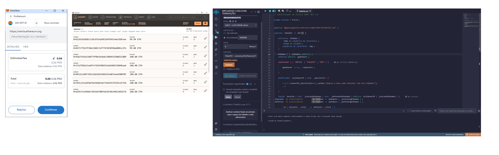

# DIO NFT Pokémon

 Criando o seu NFT de Pokémon com Blockchain
---
 ## Objetivo

 Estudar os métodos de criação de NFT através de um smart contract na rede Ethereum.
 Vai ser criado uma coleção de personagens da série Pokémon que serão implementado nos os estudos.

 
 ----
 ## Tecnologias utilizadas
 * [Ide Remix](https://remix.ethereum.org/)
 * [Ganache](https://archive.trufflesuite.com/ganache/)
 * [Metamask](https://metamask.io/)

---
## Smart contract

[Pokedio.sol](PokeDIO.sol)

-----
## Resultado do deploy

Os resultados seguem abaixo com print das telas tanto da wallet metamask, solicitando confirmação da execução do deploy, como do Ganache e do site do remix

---
### Autor

[@Cunha-1979](https://www.github.com/Cunha-1979)

---
### Créditos:

[@Cassiano](https://https://github.com/cassianobrexbit) - Criador do código, Expert da Dio.

[@openzeppelin](https://github.com/OpenZeppelin) - *Parte do codigo foi importado*
